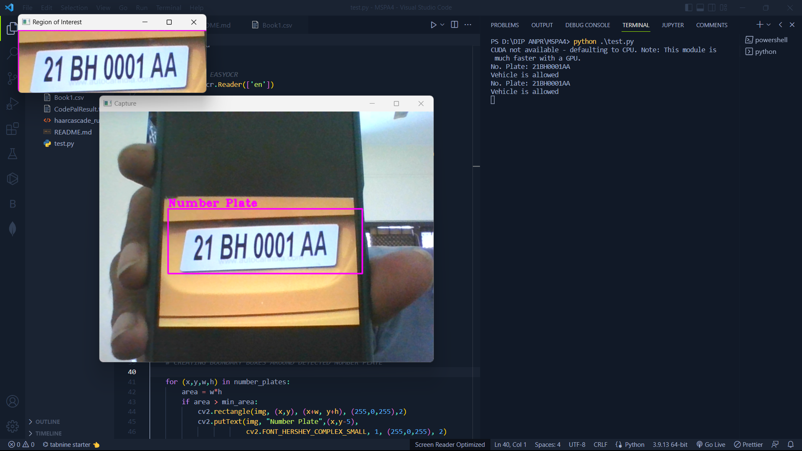

# ILLEGAL PARKING DETECTION USING ANPR TECHNOLOGY

## CODE EXPLANATION

The file `program.py` is a Python script that uses OpenCV and EasyOCR libraries to recognize license plates from a live video stream. 
It starts by importing the necessary libraries, including OpenCV, EasyOCR, Pandas, and Winsound. It then initializes 
EasyOCR and sets the frame width and height for the video capture window.

Then a pre-trained Haar Cascade classifier is loaded for detecting license plates and sets the minimum area 
required for a detected object to be considered a license plate. 

It then starts the video capture using the default camera and sets the brightness to 150.
The script then enters a loop that reads frames from the video capture and processes them. It first converts the RGB 
image to grayscale and then uses the Haar Cascade classifier to detect license plates in the image. It then creates 
boundary boxes around the detected license plates and separates them from the rest of the image.

The script then uses EasyOCR to recognize the text on the license plate and converts it to uppercase. It then reads a 
pre-defined list of valid license plates from a CSV (Book.csv) file and checks if the recognized license plate is valid or not. 
If it is invalid, it beeps and displays a message that the vehicle is not allowed; otherwise, it displays a message that the 
vehicle is allowed.

The script then waits for 5 seconds (timer can be modified in the "program.py" file) before processing the next frame. It displays the video capture with the detected license plates and waits for the user to press the "s" key to stop the video capture.

## INSTRUCTIONS TO RUN CODE
- Clone the github repository OR download and extract the zip
- Run the command to install the required libraries
```
pip install opencv-python easyocr pandas
```
- Check if the path for `haarcascade file` and `Book1.csv` file are set properly in "program.py"
- Once all the libraries are installed successfully, run the `program.py` file 
```
python program.py
```
## OUTPUT
<p align="center">
  
</p>

## POSSIBLE BUGS

- The script may not work properly if the camera is not connected or is not working.
- The Haar Cascade classifier may not detect license plates accurately in all lighting conditions.
- The EasyOCR library may not recognize the text on the license plate accurately in all fonts and sizes.
- The script may not work properly if the CSV file containing the valid license plates is not formatted correctly.

## POSSIBLE IMPROVEMENTS

- Use a deep learning-based object detection algorithm instead of the Haar Cascade classifier for better accuracy.
- Use a more advanced OCR library that can recognize license plates in different languages and fonts.
- Add a feature to store the images of the detected license plates for future reference.
- Add a feature to send an email or SMS notification when an invalid license plate is detected.

## REFERENCES

- OpenCV
- EasyOCR
- Pandas
